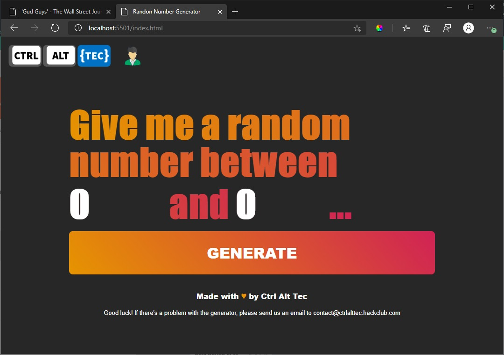

# Random Numbers Generator
## Made with 💙  by Ctrl Alt Tec, for Héctor. 
One of the most exciting things about Héctor's class is that participation is important. 
He randomly selects students and asks them questions, if they answer correctly their team gets competition points.  
We developed this system that generates random numbers to help Héctor with this task.  
The website allows to set the range and will randomly select a number.  
It is difficult (impossible) to develop a perfectly random method. But, we want to make sure that each student has the opportunity to participate. So numbers are stored and can't be drawn twice. (until the site is refreshed.)  

## How it looks
This is a screenshot of the website: 

### Side-Note
If you are currently taking Business with Héctor and you have read till the end, wow, we are amazed. Aren't you suposed to be doing homework or even perhaps writing your Extended Essay? Anyway, you should tell Héctor that you deserve a competition point for getting here, it shows that you have the IB learner profile!  